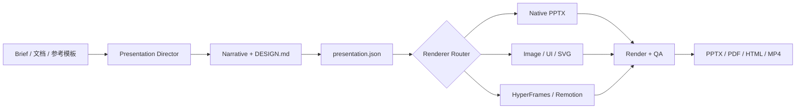

# Codex Presentation Director

面向 Codex Desktop 的轻量演示导演插件。它负责叙事规划、设计方向、参考选择、渲染路由、动效预算和质量审查，并把具体生成工作交给 Presentations、Image Generation、HyperFrames、Remotion 等专业能力。

> 核心原则：Skill 轻量化，能力插件化，参考资料可溯源且按需加载。

## 能力概览

- 从主题、文档、参考 PPTX 或指定设计方向规划完整演示。
- 生成并锁定 `DESIGN.md` 与 `presentation.json`，防止跨页风格漂移。
- 支持可编辑 PPTX、SVG 架构图、产品 UI 截图、图片式视觉页和视频页。
- 为短动效路由 HyperFrames，为多场景产品演示路由 Remotion。
- 内置 9 套 Design DNA 和 7 套角色型参考包。
- 内置 104 个压缩预览，raw 原件与高分辨率素材存放在可选外部缓存。
- 使用来源 URL、页码、SHA-256、字节数和图片尺寸完成逐项溯源。
- 支持无缓存运行、部分缓存和完整缓存验证。

## 工作方式



Director 只负责决策、约束和验收，不重复实现图片模型、视频引擎或 PowerPoint XML。

## 目录结构

```text
codex-presentation-director/
├── .codex-plugin/
│   └── plugin.json
├── skills/
│   └── codex-presentation-director/
│       ├── SKILL.md
│       ├── agents/
│       ├── assets/
│       │   ├── reference-library/
│       │   └── workspace-template/
│       ├── references/
│       │   ├── atlas-*.yaml
│       │   └── role-packs/
│       └── scripts/
└── README.md
```

## 安装与使用

### 作为本地 Skill 使用

当前 Codex CLI 通过 marketplace 安装标准插件。如果该仓库尚未发布到你的 marketplace，可以先直接安装其中的 Skill。

Windows PowerShell：

```powershell
git clone https://github.com/Wilder1222/codex-presentation-director.git
cd codex-presentation-director

$userProfile = [Environment]::GetFolderPath("UserProfile")
$skillTarget = Join-Path $userProfile ".codex\skills\codex-presentation-director"
Copy-Item -LiteralPath ".\skills\codex-presentation-director" -Destination $skillTarget -Recurse -Force
```

安装后开启一个新的 Codex 任务，使新 Skill 被重新发现。

### 作为标准插件验证

仓库根目录已经符合 Codex 插件结构，入口为 [`.codex-plugin/plugin.json`](.codex-plugin/plugin.json)。

```powershell
python "$env:USERPROFILE\.codex\skills\.system\plugin-creator\scripts\validate_plugin.py" .
python "$env:USERPROFILE\.codex\skills\.system\skill-creator\scripts\quick_validate.py" ".\skills\codex-presentation-director"
```

Codex CLI 只从已配置的 marketplace 安装插件：

```text
codex plugin marketplace add <marketplace-source>
codex plugin add codex-presentation-director@<marketplace-name>
```

本仓库是插件源码包，不包含 marketplace 索引；发布到团队或个人 marketplace 是独立步骤。

## 使用示例

安装后可在 Codex 中使用：

```text
使用 $codex-presentation-director，参考公司模板制作一份 12 页 AI Agent 产品介绍 PPT。
```

```text
使用 $codex-presentation-director，把这份技术方案重构成适合管理层汇报的演示，架构页需要可编辑。
```

```text
使用 $codex-presentation-director，采用 OpenAI editorial 作为主参考，架构页只借鉴 NVIDIA 的分层表达，并生成 10 秒架构动画。
```

Skill 会优先执行以下硬门槛：

1. 明确观众、预期行动和中心结论。
2. 只锁定一个主设计方向。
3. 在生成视觉前创建 `DESIGN.md`。
4. 在渲染前创建 `presentation.json`。
5. 先完成最重要的静态画面，再添加动画。
6. 交付前渲染并检查所有页面和动效。

## Design Atlas

完整 Design DNA：

- Apple：产品发布、极简叙事和镜头式节奏。
- OpenAI：编辑式技术叙事、概念解释和克制视觉。
- NVIDIA：技术平台、分层架构、生态与性能证据。
- GitHub：开发者协作、社区和状态型动效。
- IBM：工程网格、企业系统和数据证据。
- Google：多产品叙事、表达性形状和状态变化。
- Spotify：文化节奏、设计原则和模块化设计系统。
- Figma：模块重组、协作过程和创意活动系统。
- Human Marketplace：人本市场、信任和双边旅程。

角色型参考包仅影响指定页面，不改变整套演示的全局品牌：

- Cloudflare：网络、安全、控制平面。
- Stripe：API 金融、支付和经济网络。
- Vercel：开发者产品与交互演示。
- Snowflake：SaaS 平台、Agent 控制和增长证据。
- Adobe：创意工作流和产品组合。
- Salesforce：客户成功、企业生态和经常性收入。
- BCG：结论先行、咨询框架和转型路径。

## 轻量参考库

插件包约 4.56 MiB，不包含 raw PDF 或高分辨率审查素材。

插件内保留：

- [`sources.json`](skills/codex-presentation-director/assets/reference-library/sources.json)：38 个来源的官方 URL、权限和缓存目标路径。
- [`catalog.json`](skills/codex-presentation-director/assets/reference-library/catalog.json)：104 个精选案例的页面角色、来源页码与预览路径。
- [`provenance.json`](skills/codex-presentation-director/assets/reference-library/provenance.json)：SHA-256、字节数、页数和尺寸。
- `previews/`：104 张压缩 WebP 预览。

默认外部缓存：

```text
~/.codex/cache/codex-presentation-director/reference-library
```

可通过环境变量覆盖：

```powershell
$env:CODEX_PRESENTATION_REFERENCE_CACHE = "D:\presentation-reference-cache"
```

### 查看 raw 来源链接

不会下载文件：

```powershell
node .\skills\codex-presentation-director\scripts\collect-reference-library.mjs --list
```

### 按需加载一个 raw PDF

```powershell
node .\skills\codex-presentation-director\scripts\collect-reference-library.mjs --source <source-id>
```

对于标记为 heavy 的来源，需要显式添加 `--include-heavy`。只有计划完整刷新时才使用 `--all`。

### 按需加载 Spotify Design

```powershell
# 仅列出可用组
.\skills\codex-presentation-director\scripts\collect-spotify-reference-assets.ps1

# 加载一组
.\skills\codex-presentation-director\scripts\collect-spotify-reference-assets.ps1 -Group principles
```

可用组为 `brand`、`principles` 和 `systems`。

## 验证

验证插件结构：

```powershell
python "$env:USERPROFILE\.codex\skills\.system\plugin-creator\scripts\validate_plugin.py" .
```

验证参考元数据和内置预览，不要求本地缓存：

```powershell
python .\skills\codex-presentation-director\scripts\validate-reference-library.py
```

验证所有缓存原件和高分辨率素材：

```powershell
python .\skills\codex-presentation-director\scripts\validate-reference-library.py --require-cache
```

验证生成项目的工作区：

```powershell
node .\skills\codex-presentation-director\scripts\validate-workspace.mjs <project-directory>
```

## 专业能力依赖

Director 会按页面需求调用相应能力：

| 任务 | 推荐能力 |
|---|---|
| PPTX 创建、编辑、模板复用 | Presentations |
| 产品图、概念图、背景 | Image Generation |
| 精确架构、流程和路线图 | Native PPT / SVG / Graphviz |
| 产品 UI | HTML / React + Browser Capture |
| 3–15 秒短动画 | HyperFrames |
| 15–90 秒多场景演示 | Remotion |

专业能力不可用时，Skill 会保留静态布局与可替换 poster frame，不会虚假声明已生成动画或完全可编辑内容。

## 版权与品牌边界

- 公司材料仅用于内部设计研究，不作为可再分发模板。
- 不复制公司 Logo、官方营销文案、专有字体、产品素材或精确页面构图。
- 对外输出使用 `*-inspired` 或抽象角色名称，不暗示任何公司背书。
- 外部来源对页面设计产生实质影响时，应在演讲者备注中保留来源链接。
- 提交或分发外部 reference cache 前，需要单独检查每个来源的许可条件。

详细规则见 [`reference-library.md`](skills/codex-presentation-director/references/reference-library.md) 和 [`source-registry.yaml`](skills/codex-presentation-director/references/source-registry.yaml)。
