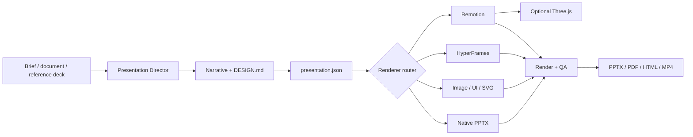

<div align="center">


# Codex Presentation Director

**Turn content, reference decks, and design intent into coherent, verifiable, delivery-ready presentations.**


[](LICENSE)

[Showcase](#showcase) · [Quick start](#quick-start) · [Examples](#usage-examples) · [Capabilities](#capabilities-and-boundaries) · [Developer guide](#developer-guide)

</div>

## Why this plugin exists

Codex can already create images, presentations, websites, and videos. A professional deck still needs one system to coordinate narrative, visual direction, source provenance, renderer choice, editability, motion, and final review.

Codex Presentation Director is a lightweight presentation-director plugin. It does not reimplement image models, video engines, or PowerPoint XML. Instead, it establishes a shared design and content contract, then routes each slide to the capability best suited to the job:

- **Presentations** for editable PPTX, template reuse, charts, and native objects.
- **Image Generation** for hero visuals, product concepts, and backgrounds.
- **SVG / Graphviz** for accurate architecture, process, and topology diagrams.
- **HTML / React** for realistic product UI and browser captures.
- **HyperFrames** for 3–15 second motion pieces and progressive architecture builds.
- **Remotion** for multi-scene product demos, narration, subtitles, and video.
- **Three.js** as an optional Remotion component for turntables, exploded views, and spatial storytelling.

The operating principle is simple: **keep the Skill lightweight, delegate generation to specialist capabilities, preserve design knowledge as reusable assets, and validate every deliverable.**

## Showcase

### From brief to final QA

Convert the brief into a shared design contract, route assets to the right renderers, assemble the deck, and run a visual review before delivery.


### One design contract, multiple controlled outputs

The Director can combine native PowerPoint objects, precise vector diagrams, generated visuals, product UI, and replaceable motion media while declaring editability honestly.


### Optional Three.js product sequences

When spatial depth carries meaning, Three.js can run inside Remotion to produce deterministic 3D video plus a static poster for PowerPoint preview and fallback playback.


## Who it is for

| Audience | What they can do |
|---|---|
| Business users | Create product decks, technical proposals, investor materials, and executive presentations in natural language. |
| Presentation authors | Keep reference templates, generated visuals, diagrams, UI, and motion inside one coherent visual system. |
| Developers | Extend the Design Atlas, slide patterns, motion patterns, routing rules, intermediate contracts, and automated checks. |

## Core capabilities

- Plan a complete presentation from a topic, document, reference PPTX, or named visual direction.
- Lock `DESIGN.md` before generating visual assets to reduce cross-slide style drift.
- Use `presentation.json` as the source of truth for narrative, renderer routing, assets, motion, editability, and provenance.
- Select native PowerPoint, image, SVG, UI, HyperFrames, or Remotion per slide.
- Reuse abstracted design principles from Apple, OpenAI, NVIDIA, Spotify, and other reference systems.
- Prioritize local enterprise templates and restrict external references to explicitly assigned slide roles.
- Load original reference files on demand instead of shipping large raw PDFs in the plugin repository.
- Enforce posters, provenance, copyright boundaries, a motion budget, and final visual QA.
- Use optional Three.js 3D sequences without adding a 3D runtime dependency to the plugin itself.
- Detect installed providers before work begins, show platform-specific installation guidance for missing capabilities, and block silent downgrade.

## Capability profiles and install prompts

The Director is useful on its own for narrative, Design Atlas selection, manifests, and review. Its complete production workflow depends on specialist providers. A preflight check records what is actually installed instead of assuming that a documented integration is available. Skills must be discoverable in a supported skills directory, project packages must exist under `node_modules`, and command providers must be available on `PATH`; a dependency declaration by itself is not treated as an installation.

| Profile | Required capabilities |
|---|---|
| `director-core` | Planning, reference selection, routing, and review contracts. |
| `static-studio` | Editable presentation output. |
| `visual-studio` | Static Studio, image generation, and browser-based UI capture. |
| `motion-studio` | Visual Studio, short motion, and multi-scene video. |
| `full-studio` | The complete general workflow; 3D remains on demand. |
| `spatial-studio` | Full Studio plus Three.js, React Three Fiber, and `@remotion/three`. |

Run preflight for an existing project:

```powershell
node .\skills\codex-presentation-director\scripts\check-capabilities.mjs `
  --platform codex `
  --project D:\presentations\agent-platform `
  --profile full-studio `
  --write
```

When a required capability is missing, the checker prints:

- the requested and currently resolved profiles;
- the missing capability and the output it blocks;
- installation guidance for the active Agent platform;
- the exact fallback impact.

The Skill must stop at that point. It may continue with a fallback only after the user explicitly approves the loss of capability and preflight is rerun with `--approve-fallbacks --write`. Unsupported renderers must then be replaced in `presentation.json`. A partial installation is never described as Full Studio.

The dependency registry intentionally stores detectable provider contracts rather than fabricated marketplace IDs. When a host exposes a verified native install action, the Agent should use it. Otherwise it presents the registry's platform-specific installation instructions.

## Quick start

### Requirements

- Codex Desktop/CLI, Claude Code, GitHub Copilot, Gemini CLI, Cursor, or another Agent Skills-compatible host.
- Node.js 18 or newer for workspace and capability validation scripts.
- Access to this GitHub repository from the environment where the Agent runs.
- The specialist capabilities required by your chosen profile. Three.js dependencies are only needed in presentation projects that actually use 3D.

### Codex: add the plugin marketplace

```powershell
codex plugin marketplace add Wilder1222/codex-presentation-director --ref main
```

### Codex: install the plugin

```powershell
codex plugin add codex-presentation-director@wilder1222-plugins
```

Open a new Codex task after installation so the Skill can be discovered.

### Other Agent hosts

This repository also includes a Claude Code plugin manifest, a Gemini extension manifest, and a standards-based `SKILL.md` that GitHub Copilot and Cursor can discover from a supported skills directory.

| Host | Adapter | Installation approach |
|---|---|---|
| Claude Code | `.claude-plugin/plugin.json` | Add this repository as a trusted plugin source or copy the Skill into a configured Claude skills directory. |
| Gemini CLI | `gemini-extension.json` | Install or link this repository as an extension so the root `skills/` directory is visible. |
| GitHub Copilot | `SKILL.md` | Copy or link `skills/codex-presentation-director` into a Copilot-supported Agent Skills directory. |
| Cursor | `SKILL.md` | Copy or link `skills/codex-presentation-director` into a Cursor-supported Agent Skills directory. |

The canonical Skill stays under `skills/codex-presentation-director`; platform adapters do not fork its behavior. Run preflight with `--platform claude-code`, `copilot`, `gemini`, or `cursor` after installation.

### Create a presentation

```text
Use $codex-presentation-director to create a 12-slide AI agent product deck
based on my uploaded company template. The audience is enterprise technology
leaders and the objective is to secure approval for a pilot. Keep the
architecture slide accurate and editable; generated visuals are allowed on
product slides.
```

The plugin will:

1. Check installed capabilities and prompt for any required provider.
2. Define the audience, desired action, and central takeaway.
3. Select one primary design direction.
4. Create `DESIGN.md` and `presentation.json`.
5. Generate images, UI, diagrams, motion, or 3D assets as required.
6. Assemble the presentation.
7. Render and review every slide.
8. Deliver PPTX, PDF, HTML, or MP4 outputs with honest editability disclosure.

## Usage examples

### Enterprise template mode

```text
Use $codex-presentation-director to update this quarterly business review.
Strictly preserve the uploaded PPTX master, typography, colors, and footer.
Keep every chart and text block editable.
```

### Product launch mode

```text
Use $codex-presentation-director to create a launch deck for an AI hardware
product. Use a restrained product-reveal language, create an original hero
visual, and produce a 10-second exploded-view sequence for slide 6.
```

### Technical architecture mode

```text
Use $codex-presentation-director to turn this technical proposal into an
8-slide executive narrative. Render architecture relationships with SVG or
native PowerPoint shapes. Do not use an image model for nodes, connectors,
or labels.
```

### Three.js 3D mode

```text
Use $codex-presentation-director to create a Three.js turntable and exploded
assembly for the product slide. Render through Remotion, embed the resulting
MP4, keep a static poster in the deck, and record the source and license for
every model, texture, and environment asset.
```

## How it works



The Director owns decisions, contracts, and acceptance criteria. Specialist capabilities own generation. `DESIGN.md` and `presentation.json` are the shared source of truth for every executor.

## Renderer routing

| Slide task | Default route | Editability |
|---|---|---|
| Titles, body text, charts, and tables | Native PowerPoint | `native` |
| Simple architecture and process diagrams | Native PowerPoint shapes | `native` |
| Complex architecture, topology, and roadmaps | SVG / Graphviz | `mixed` |
| Hero, concept, and emotional visuals | Image Generation | `flattened` or `mixed` |
| Product interfaces | HTML / React + browser capture | `mixed` |
| 3–15 second motion pieces | HyperFrames | `replaceable-media` |
| 15–90 second demos | Remotion | `replaceable-media` |
| Product turntables, exploded views, spatial layers | Three.js + `@remotion/three` | `replaceable-media` |

Images and videos are replaceable media, not native PowerPoint objects. A deck containing `replaceable-media` or `flattened` slides must never be described as fully editable.

## Three.js as an optional 3D component

Three.js is not a standalone renderer in this project. It is an optional component inside the `remotion_video` route.

Good uses:

- Product turntables.
- Exploded assemblies.
- Spatial hierarchy.
- A small number of deliberate camera moves.
- Visualizations where depth carries meaning.

Poor uses:

- Conventional architecture diagrams.
- Charts, tables, and roadmaps.
- Dense labels or explanatory copy.
- Decorative particles, glowing tunnels, globes, or grids added only to imply “technology.”

Implementation constraints:

- Install Three.js, React Three Fiber, and `@remotion/three` only in presentation projects that use them.
- Drive models, cameras, materials, and shader parameters from the deterministic Remotion frame timeline.
- Export both MP4/WebM and a static poster for every 3D video.
- Record the source and license for GLB/glTF models, textures, and environment maps.
- HyperFrames may composite a finished 3D video, but it must not manage an independent WebGL animation loop.

See [`renderers/threejs.md`](skills/codex-presentation-director/references/renderers/threejs.md) for the full contract.

## Design Atlas

The Atlas stores abstracted design principles. It does not redistribute company templates, logos, or proprietary assets.

Built-in Design DNA:

| Atlas | Best suited to |
|---|---|
| Apple | Product reveals, minimal narrative, and cinematic pacing. |
| OpenAI | Editorial technology storytelling, concept explanation, and restrained visuals. |
| NVIDIA | Platform architecture, ecosystems, performance, and technical evidence. |
| GitHub | Developer collaboration, community, and state change. |
| IBM | Engineering grids, enterprise systems, and evidence-led data. |
| Google | Multi-product narratives, expressive shapes, and state transitions. |
| Spotify | Cultural rhythm, design principles, and modular systems. |
| Figma | Modular recomposition, collaboration, and creative activity. |
| Human Marketplace | Human-centered markets, trust, and two-sided journeys. |

Role-specific reference packs influence only assigned slides and never replace the global brand system. Included role packs cover Cloudflare, Stripe, Vercel, Snowflake, Adobe, Salesforce, and BCG.

## Reference library and provenance

The plugin packages 104 compressed previews backed by 38 source records. Raw PDFs and high-resolution assets live in an optional external cache and are excluded from Git.

Default cache location:

```text
~/.codex/cache/codex-presentation-director/reference-library
```

Override it with an environment variable:

```powershell
$env:PRESENTATION_REFERENCE_CACHE = "D:\presentation-reference-cache"
```

`CODEX_PRESENTATION_REFERENCE_CACHE` remains supported as a legacy alias.

List sources without downloading anything:

```powershell
node .\skills\codex-presentation-director\scripts\collect-reference-library.mjs --list
```

Load one source on demand:

```powershell
node .\skills\codex-presentation-director\scripts\collect-reference-library.mjs --source <source-id>
```

Add `--include-heavy` explicitly for a source marked `heavy`. Use `--all` only when intentionally rebuilding the complete local reference cache.

## Capabilities and boundaries

### The plugin is responsible for

- Narrative planning and slide roles.
- Design direction and reference selection.
- Renderer and motion routing.
- Asset planning and editability declarations.
- Source, copyright, and brand boundaries.
- Screenshot, structure, and motion quality review.

### The plugin is not responsible for

- Reimplementing image models, video engines, or PowerPoint XML.
- Automatically monitoring or continuously downloading external design materials.
- Redistributing public company materials as commercially reusable templates.
- Turning image or video slides into native editable PowerPoint objects.
- Adding motion or 3D when it does not improve understanding.

## Developer guide

### Repository structure

```text
codex-presentation-director/
├── .agents/plugins/marketplace.json       # Marketplace catalog
├── .codex-plugin/plugin.json              # Standard plugin metadata
├── .claude-plugin/plugin.json             # Claude Code adapter
├── gemini-extension.json                  # Gemini CLI adapter
├── assets/                                # Marketplace icon and screenshots
├── LICENSE                                # MIT License
├── skills/codex-presentation-director/
│   ├── SKILL.md                           # Director entry point and hard gates
│   ├── agents/openai.yaml                 # Codex UI metadata
│   ├── assets/
│   │   ├── reference-library/             # Sources, catalog, provenance, previews
│   │   └── workspace-template/            # New presentation workspace template
│   ├── references/
│   │   ├── atlas/                         # Design DNA
│   │   ├── platforms/                     # Host-specific install and fallback behavior
│   │   ├── role-packs/                    # Slide-role reference packs
│   │   ├── patterns/                      # Layout and motion patterns
│   │   ├── renderers/                     # Specialized renderer contracts
│   │   ├── library/                       # Reference operations and registry
│   │   ├── routing.md                     # Renderer routing
│   │   ├── dependencies.json              # Capability profiles and provider detection
│   │   ├── manifest.md                    # Intermediate manifest contract
│   │   └── review.md                      # Delivery acceptance criteria
│   └── scripts/                           # Initialization, collection, validation
└── README.md
```

### Initialize a presentation workspace

```powershell
node .\skills\codex-presentation-director\scripts\init-workspace.mjs `
  D:\presentations\agent-platform `
  --title "AI Agent Platform" `
  --language en-US `
  --platform codex `
  --profile full-studio
```

The generated workspace contains:

```text
DESIGN.md
presentation.json
assets/generated/images/
assets/generated/ui/
assets/models/
assets/textures/
diagrams/
motion/hyperframes/
motion/remotion/three/
output/
tmp/
```

### Minimal manifest

```json
{
  "version": "1.0",
  "status": "planning",
  "capabilityProfile": {
    "platform": "codex",
    "requestedMode": "full-studio",
    "resolvedMode": "full-studio",
    "checkedAt": "2026-07-30T08:00:00.000Z",
    "required": ["presentation", "image_generation", "ui_capture", "short_motion", "video"],
    "available": ["presentation", "image_generation", "ui_capture", "short_motion", "video"],
    "missing": [],
    "taskReady": true,
    "fallbacksApproved": false
  },
  "deck": {
    "title": "AI Agent Platform",
    "audience": "Enterprise technology leaders",
    "objective": "Approve a pilot",
    "centralTakeaway": "A governed runtime makes agent automation controllable.",
    "language": "en-US",
    "aspectRatio": "16:9",
    "primaryReference": "openai-editorial-inspired",
    "secondaryReferences": [],
    "outputs": ["pptx", "pdf"]
  },
  "motionBudget": {
    "maxVideoSlides": 3,
    "maxTotalVideoSeconds": 45,
    "maxTransitionStyles": 2
  },
  "slides": []
}
```

See [`manifest.md`](skills/codex-presentation-director/references/manifest.md) for the complete schema and 3D examples.

### Add a Design Atlas entry

1. Create `references/atlas/<name>.yaml`.
2. Store abstract design principles, not redistributable proprietary assets.
3. Register the entry in the on-demand loading table in `SKILL.md`.
4. Update the source registry and reference catalog when external material is involved.
5. Update the Atlas table in this README and run the complete validation suite.

### Add a role pack

1. Create `references/role-packs/<name>.yaml`.
2. Limit it to explicit slide roles.
3. Do not let it override global typography, color, or brand rules.
4. Register it in `SKILL.md` and `routing.md`.

### Add a renderer or motion capability

1. Define use conditions and fallback behavior in `routing.md`.
2. Define the intermediate data contract in `manifest.md`.
3. Define handoff fields in `prompt-contracts.md`.
4. Define acceptance criteria in `review.md`.
5. Update `validate-workspace.mjs` so invalid routing is rejected automatically.

### Validation

Check installed capabilities and update the workspace profile:

```powershell
node .\skills\codex-presentation-director\scripts\check-capabilities.mjs `
  --platform codex `
  --project <project-directory> `
  --profile full-studio `
  --write
```

Validate the standard plugin structure:

```powershell
python "$env:USERPROFILE\.codex\skills\.system\plugin-creator\scripts\validate_plugin.py" .
```

Validate the Skill:

```powershell
python "$env:USERPROFILE\.codex\skills\.system\skill-creator\scripts\quick_validate.py" `
  ".\skills\codex-presentation-director"
```

Validate progressive loading, reference links, and internal Skill structure:

```powershell
node .\skills\codex-presentation-director\scripts\validate-skill-structure.mjs
```

Validate reference metadata and previews:

```powershell
python .\skills\codex-presentation-director\scripts\validate-reference-library.py
```

Validate a presentation workspace:

```powershell
node .\skills\codex-presentation-director\scripts\validate-workspace.mjs <project-directory>
```

Use `--allow-draft` during development. Final delivery must pass without it.

### Contribution workflow

1. Create a `codex/<feature-name>` branch from `main`.
2. Update the Skill, contracts, validators, and README as required.
3. Run plugin, Skill, reference-library, and workspace validation.
4. Confirm that raw PDFs, models, textures, caches, and `node_modules` are not included in the commit.
5. Open a pull request describing user-visible behavior changes and compatibility impact.

## Copyright and license

- Source code and original documentation in this repository are available under the [MIT License](LICENSE).
- Apple, OpenAI, NVIDIA, and other third-party materials are used only for internal design analysis and source indexing.
- Do not copy third-party logos, official marketing copy, proprietary fonts, proprietary product assets, or exact page compositions.
- Public outputs should use `*-inspired` or abstract role names and must not imply endorsement.
- When an external reference, fact, or asset materially influences a slide, preserve its source in speaker notes.
- Remotion, Three.js, and other specialist capabilities remain subject to their own licenses.
- The MIT License does not alter the rights attached to external references, brand names, screenshots, fonts, models, or other third-party assets recorded by the Design Atlas.

## Design and engineering references

- [OpenAI Agent Skills](https://github.com/openai/skills) for discoverable, installable, progressively loaded Skills.
- [Remotion](https://github.com/remotion-dev/remotion) for deterministic React-driven video composition.
- [Three.js](https://threejs.org/) for Web 3D scenes, cameras, materials, and model rendering.
- [PptxGenJS](https://github.com/gitbrent/PptxGenJS) for the capabilities and boundaries of programmatic PowerPoint generation.

---

If you remember one rule, make it this: **define the narrative and design contract before selecting renderers; never let a tool's capabilities decide what the presentation should become.**
