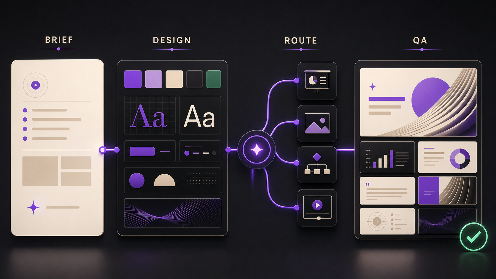
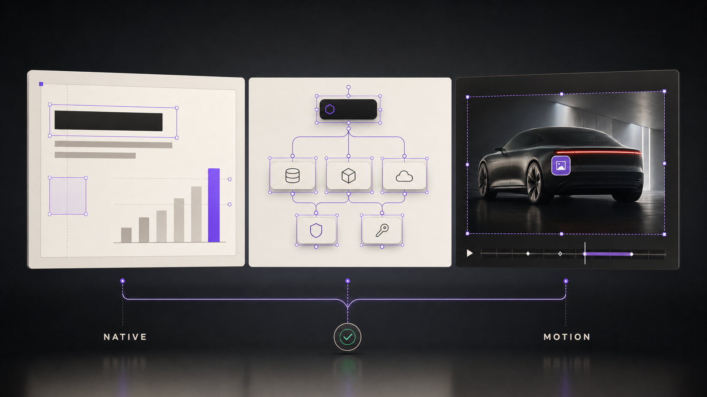
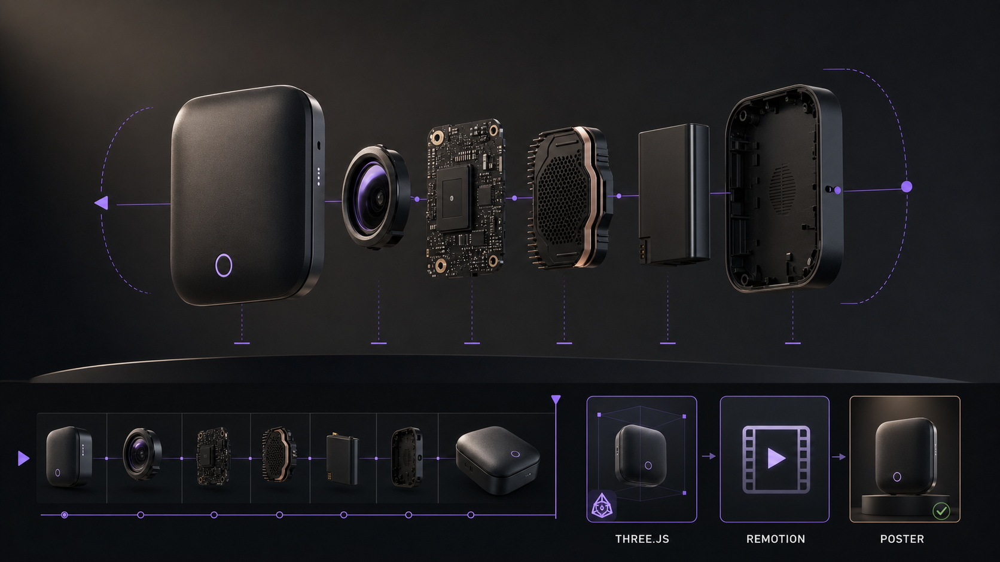

<div align="center">


# Presentation Director

**Design the story. Direct the tools. Deliver a presentation you can use immediately.**

Turn a brief, document, or reference deck into a ready-to-present PPTX with a clear narrative, high visual impact, high-fidelity execution, and native-first editability.


[](LICENSE)

[Showcase](#showcase) · [Why Presentation Director](#why-presentation-director) · [Quick start](#quick-start) · [Examples](#example-prompts) · [Documentation](#documentation)

</div>

## Showcase

### From brief to final QA

Shape the narrative, lock a shared design contract, route every slide to the right specialist capability, and review the rendered result before delivery.



### One design contract, multiple controlled outputs

Combine editable PowerPoint content, precise vector diagrams, generated visuals, realistic product UI, and replaceable motion media without losing visual consistency.



### Spatial product storytelling when it adds meaning

Use optional Three.js scenes inside Remotion for deterministic turntables, exploded views, and spatial sequences, with a static poster for preview and fallback playback.



## Why Presentation Director

AI can generate slides. Presentation Director coordinates the decisions that make a deck feel intentionally designed.

| | What changes |
|---|---|
| **A finished PPTX—not a draft** | The primary artifact opens in PowerPoint, contains every completed slide, and is ready to present without repair. Source files and previews support the deck; they do not replace it. |
| **A narrative, not an agenda** | Every slide advances one causal argument, titles state takeaways, and the closing resolves the audience decision established at the opening. |
| **Evidence and design intent are compiled before rendering** | Stable claims and sources, a narrative map, renderer-neutral page designs, a visual rhythm strip, a dependency-aware asset plan, and immutable provider briefs catch weak reasoning and inconsistent art direction before expensive generation starts. |
| **One visual system** | `DESIGN.md` locks typography, color, spacing, imagery, diagram language, and motion before production begins. |
| **Authored, not generic** | A design thesis, content-derived motif, signature moves, anti-defaults, and content-swap test prevent interchangeable AI slide aesthetics. |
| **The right tool per slide** | Native PowerPoint, image generation, SVG, browser UI, HyperFrames, Remotion, and optional Three.js are selected by purpose rather than novelty. |
| **Reusable design intelligence** | The built-in Design Atlas abstracts proven patterns from product launches, editorial technology stories, technical platforms, developer ecosystems, and enterprise communication. |
| **Native-first editability** | Text, data, tables, charts, and simple diagrams stay editable; images and motion remain replaceable; full-page raster slides require an explicit exception. |
| **Content-directed native motion** | Every slide receives a traceable PowerPoint animation plan: fade for reveals, morph for meaningful comparisons, and wipe for ordered evidence—bounded by a motion budget and verified in the final PPTX receipt. |
| **Designed for the room, not only the file** | A timed delivery plan gives every slide a speaking budget, complementary presenter detail, attention cues, and a purposeful transition. |
| **Quality before delivery** | Exact renders and timed rehearsal are scored separately; delivery includes a transparent per-slide report of native, replaceable, embedded, flattened, and conversion-loss behavior. |
| **Faster iteration without blind reuse** | Representative samples lock the direction first; content-addressed caching rebuilds only changed slides; an exclusive-write task graph enables safe parallel production. |

## Core capabilities

- Turn a topic, document, reference deck, or company template into a complete, ready-to-present PPTX—not only an outline, source project, preview, or PDF.
- Build a causal narrative with one communication job, one claim per slide, takeaway titles, evidence, implications, and a resolved close.
- Compile evidence, narrative, slide questions, consequences, bridges, renderer-neutral page designs, visual silhouettes, density, focal modes, planned peaks, and task-specific acceptance checks before production.
- Infer or accept content-preference DNA for compression, evidence order, examples, rejected patterns, and speaker-note depth; compile a rehearsable per-slide delivery plan.
- When style is unspecified, either auto-select the best-fit direction or present visual candidates for the user to choose.
- Preserve enterprise masters and brand rules, or establish an original design direction from the Design Atlas.
- Translate references into project-specific Design DNA instead of copying a company style or accepting generic AI defaults.
- Generate hero visuals, product concepts, realistic UI, precise technical diagrams, and data-led slides within one system.
- Decompose assets by role, continuity family, dependencies, reuse policy, and acceptance criteria; compare high-impact visual variants and preserve the selected candidate with traceable hashes.
- Create short progressive animations with HyperFrames and multi-scene product demos with Remotion.
- Automatically select and apply native PowerPoint transitions and object animations from slide semantics, with explicit static fallbacks and final-PPTX audit evidence.
- Add Three.js only when depth communicates product structure or spatial relationships.
- Produce a high-fidelity, native-first PPTX as the primary artifact, with PDF, HTML, MP4, slide previews, and replaceable media assets as optional supporting outputs.
- Keep source provenance and usage boundaries attached to external references and generated assets.
- Detect missing specialist capabilities before production and explain what must be installed for the requested result.
- Lock representative samples before full production, then use incremental builds, bounded parallel workers, exact render observations, minimal repair rounds, and risk-based iteration QA without skipping the final full-deck review.
- Deliver independent artifact and delivery scores plus a native-capability report that makes every editability exception explicit.
- Load selected preset raw references on demand, or research official web sources for a custom direction.
- Keep copied inputs, raw references, generated assets, process records, and final outputs together in `./presentation-director/`.

## Quick start

Add the marketplace:

```powershell
codex plugin marketplace add Wilder1222/presentation-director --ref main
```

Install the plugin:

```powershell
codex plugin add presentation-director@wilder1222-plugins
```

Open a new Codex task, then describe the presentation you want:

```text
Use $presentation-director to create a 12-slide AI agent product deck
based on my uploaded company template. The audience is enterprise technology
leaders and the objective is to secure approval for a pilot. Keep the
architecture slide accurate and editable; generated visuals are allowed on
product slides.
```

Presentation Director will plan the story, establish the design system, check the required capabilities, generate the necessary assets, assemble the deck, and review the rendered output.

All project-owned files are created under the current directory's `presentation-director/` folder. The plugin does not use a user-home or system-global reference cache.

For capability profiles, provider setup, other Agent hosts, and fallback behavior, see the [Installation and Capabilities Guide](docs/INSTALLATION.md).

## Example prompts

### Let the Director choose

```text
Use $presentation-director to create this deck without intermediate design
checkpoints. Select the visual direction that best fits the audience,
decision, content density, and delivery format, then explain the choice.
```

### Compare visual directions

```text
Use $presentation-director to propose three visual directions for this
brief. Show cover, core-content, and architecture frames for each option,
then wait for my selection before producing the deck.
```

### Preserve a company template

```text
Use $presentation-director to update this quarterly business review.
Strictly preserve the uploaded PPTX master, typography, colors, and footer.
Keep every chart and text block editable.
```

### Launch a product

```text
Use $presentation-director to create a launch deck for an AI hardware
product. Use a restrained product-reveal language, create an original hero
visual, and produce a 10-second exploded-view sequence for slide 6.
```

### Explain a technical system

```text
Use $presentation-director to turn this technical proposal into an
8-slide executive narrative. Render architecture relationships with SVG or
native PowerPoint shapes. Do not use an image model for nodes, connectors,
or labels.
```

### Build a spatial product sequence

```text
Use $presentation-director to create a Three.js turntable and exploded
assembly for the product slide. Render through Remotion, embed the resulting
MP4, keep a static poster in the deck, and record the source and license for
every model, texture, and environment asset.
```

## Designed for the work behind great decks

Presentation Director supports the full range between strict enterprise delivery and high-impact product storytelling:

- **Executive and enterprise decks** with editable content and faithful template reuse.
- **Product launches** with original hero imagery, controlled reveals, UI demonstrations, and motion.
- **Technical presentations** with accurate architecture, topology, workflow, and platform diagrams.
- **Investor and strategy narratives** with clear pacing, evidence, metrics, and a decisive takeaway.
- **Multi-format delivery** when the same story must become a PowerPoint deck, web presentation, PDF, or video.

The plugin remains lightweight: it directs specialist capabilities instead of duplicating image models, video engines, browser tooling, or PowerPoint internals.

## Documentation

| Guide | Use it for |
|---|---|
| [Installation and Capabilities](docs/INSTALLATION.md) | Codex installation, other Agent hosts, capability profiles, provider checks, and fallback rules. |
| [Architecture](docs/ARCHITECTURE.md) | Workflow, source-of-truth contracts, renderer routing, editability, motion, and Three.js integration. |
| [Design Atlas and Reference Library](docs/DESIGN-ATLAS.md) | Design DNA, role packs, on-demand source loading, provenance, and copyright boundaries. |
| [Development and Contribution](docs/DEVELOPMENT.md) | Repository structure, workspace initialization, manifests, extension points, validation, and contribution workflow. |
| [Skill source](skills/presentation-director/SKILL.md) | The canonical orchestration rules used by compatible Agent hosts. |
| [Changelog](CHANGELOG.md) | Versioned user-visible changes, compatibility notes, and migration guidance. |

## License and responsible use

Presentation Director is available under the [MIT License](LICENSE). The Design Atlas stores abstract design principles, not redistributable company templates or brand assets. Third-party references remain subject to their original rights and must be used for analysis and inspiration only.

---

<div align="center">

**A presentation should be directed as one story, not generated as a pile of slides.**

</div>
