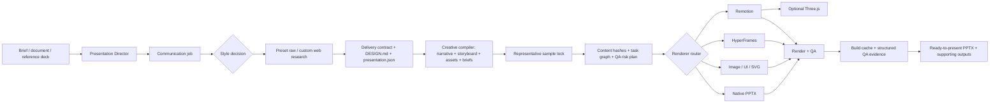

# Architecture

Presentation Director is a lightweight orchestration layer. It owns presentation decisions, shared contracts, routing, and acceptance criteria; specialist capabilities own generation.

[Back to README](../README.md) · [Installation](INSTALLATION.md) · [Development](DEVELOPMENT.md)

## System overview

The workflow is source-first, but its primary outcome is a complete PPTX that can be presented and modified immediately. The manifest and renderer sources preserve reproducibility; they do not substitute for the finished deck.

## Workspace boundary

Every project-owned persistent file lives under `<current-directory>/presentation-director/`: copied inputs, raw references, generated assets, diagrams, browser captures, HyperFrames and Remotion projects, temporary records, and final outputs. Manifest 1.5 preserves this fixed layout, compiles narrative and creative production records, validates design taste, locks representative samples, and records incremental build plus QA evidence; validation rejects workspace escape paths, stale hashes, modified provider briefs, unrecorded asset choices, and unresolved generic directions.

## Operating principles

1. **Finished PPTX first.** The task is incomplete until a ready-to-present PPTX exists, opens, renders correctly, and can be modified.
2. **Workspace-local by default.** Keep the complete presentation project portable and off user-home or system-global caches.
3. **Narrative before style.** Define the audience, desired action, central takeaway, and slide roles before evaluating visual directions.
4. **Optional style checkpoint.** Respect specified, automatic, and recommendation modes instead of forcing one interaction model.
5. **References before design.** Load selected preset raw sources or research a custom direction before locking the visual identity.
6. **Design before assets.** Lock the visual identity before images, UI, diagrams, or motion are produced.
7. **Compile before generation.** Turn the story, visual rhythm, asset dependencies, continuity families, and acceptance criteria into immutable provider briefs.
8. **Samples before scale.** Approve representative static frames before parallel full-deck production.
9. **Rebuild only what changed.** Content and output hashes may skip unchanged work, but never replace visual approval.
10. **Parallelism with ownership.** Workers write only declared slide paths; the Director owns shared truth, cache state, QA, and final assembly.
11. **Purpose before technology.** Choose a renderer because it communicates the slide correctly, not because the tool is available.
12. **One contract across providers.** Every provider reads the same design and presentation source files.
13. **Native-first editability.** Keep text, data, tables, charts, and simple diagrams editable; disclose every flattened or replaceable-media exception.
14. **Motion with a budget.** Animation is used for sequence, state change, product demonstration, or a meaningful reveal.
15. **Validation before delivery.** Risk-based iteration and structural checks culminate in a full-size review plus target-application open check.

## Source-of-truth contracts

### `DESIGN.md`

`DESIGN.md` locks the shared visual identity before asset production. It should define:

- Presentation intent and audience.
- Primary design direction and permitted secondary references.
- Design thesis, content motif, productive tensions, signature moves, and anti-defaults.
- Palette and contrast rules.
- Typography and type scale.
- Grid, margins, spacing, and density.
- Image and illustration direction.
- Diagram grammar.
- Motion language and motion budget.
- Brand, copyright, and asset restrictions.

All visual providers must read this file. Provider defaults must not override it.

### `presentation.json`

`presentation.json` tracks:

- The fixed delivery contract: ready-to-present PPTX, required narrative, high visual impact and fidelity, native-first editability, and exception-only rasterization.
- Style-decision mode, candidates, selection rationale, and reference depth.
- Locked taste profile, content-swap result, and authorship rationale.
- Preset raw loading or custom web-research status and source records.
- Deck narrative and slide order.
- Audience starting and ending states, stakes, turning point, and resolution.
- Per-slide questions, consequences, bridges, silhouettes, density, focal modes, and visual peaks.
- Slide roles and content.
- Renderer selection.
- Asset inputs and outputs.
- Motion and poster requirements.
- Editability classification.
- Source provenance.
- Capability profile and fallback approvals.
- Review and delivery status.
- Representative design samples and immutable design digest.
- Incremental build plan, content-addressed cache state, and exclusive-write task graph.
- Per-slide risk classifications and structured final QA evidence.
- Compiled narrative map, storyboard, dependency-aware asset plan with parallel execution waves, immutable provider briefs, and recorded asset selections.

See the complete contract in [`manifest.md`](../skills/presentation-director/references/manifest.md).

## Renderer routing

| Slide task | Default route | Editability |
|---|---|---|
| Titles, body text, charts, and tables | Native PowerPoint | `native` |
| Simple architecture and process diagrams | Native PowerPoint shapes | `native` |
| Complex architecture, topology, and roadmaps | SVG / Graphviz | `mixed` |
| Hero, concept, and emotional visuals | Image generation | `flattened` or `mixed` |
| Product interfaces | HTML / React + browser capture | `mixed` |
| 3–15 second motion pieces | HyperFrames | `replaceable-media` |
| 15–90 second demos | Remotion | `replaceable-media` |
| Product turntables, exploded views, spatial layers | Three.js + `@remotion/three` | `replaceable-media` |

Detailed routing rules live in [`routing.md`](../skills/presentation-director/references/routing.md).

## Editability model

| Classification | Meaning |
|---|---|
| `native` | Text, shapes, charts, and other objects can be edited directly in PowerPoint. |
| `mixed` | The slide combines native objects with replaceable SVG, image, or captured UI assets. |
| `flattened` | The visual is rendered as a single image and cannot be edited as native slide objects. |
| `replaceable-media` | The animation or video can be replaced, but its internal elements are not editable in PowerPoint. |

A deck containing flattened or replaceable-media slides must not be described as fully editable.

For Manifest 1.3+, every `image_slide` must include `rasterExceptionReason`. Full-page rasterization is reserved for cases where a unified visual composition cannot be preserved through native or mixed construction; it is prohibited for architecture, data, charts, tables, and editable factual content.

## Optimized production loop

Manifest 1.5 adds a creative quality gate to the deterministic production loop:

1. Compile the narrative map, visual storyboard, asset graph, and provider briefs.
2. Render and approve up to four representative static samples.
3. Hash the creative plan, design contract, manifest, slide inputs, and existing outputs.
4. Mark matching slides cached and changed slides dirty.
5. Generate an exclusive-write task graph for bounded parallel workers.
6. Write each slide into an isolated build capsule and finish it with a current build receipt.
7. Record inspected asset choices and successful slide builds only after declared outputs exist and hash correctly.
8. Review dirty and medium/high-risk slides during iteration.
9. Review every slide and open-check the final PPTX before delivery.

The cache accelerates revisions; it never certifies visual quality. See [`production-optimization.md`](../skills/presentation-director/references/production-optimization.md).

## Motion routing

### Native presentation motion

Use for simple, maintainable builds and transitions when the target presentation engine supports them reliably.

### HyperFrames

Use for short, focused motion pieces such as:

- Progressive architecture builds.
- Title and section reveals.
- UI interaction highlights.
- Node, edge, and data-flow sequences.
- Short looping backgrounds or overlays.

The final static layout should be correct before animation is added.

### Remotion

Use for longer or multi-scene sequences such as:

- Product demos.
- Narrated explainers.
- Subtitle-driven sequences.
- Data-driven or parameterized video.
- Compositions that include deterministic Three.js scenes.

Every embedded video requires a static poster for preview, accessibility, and fallback playback.

## Three.js integration

Three.js is an optional component inside the `remotion_video` route, not a standalone deck renderer.

Good uses include:

- Product turntables.
- Exploded assemblies.
- Spatial hierarchy.
- Deliberate camera movement.
- Visualizations where depth carries meaning.

Avoid it for conventional architecture diagrams, charts, roadmaps, dense labels, or decorative “technology” effects.

Implementation constraints:

- Install Three.js, its TypeScript definitions, React Three Fiber, and `@remotion/three` only in projects that require 3D.
- Drive scenes, cameras, materials, and shader parameters from the deterministic Remotion frame timeline.
- Export MP4 or WebM plus a static poster.
- Record the source and license for models, textures, and environment maps.
- HyperFrames may composite a completed 3D video, but it must not manage an independent WebGL animation loop.

See [`renderers/threejs.md`](../skills/presentation-director/references/renderers/threejs.md) for the full contract.

## Review gates

Final output should pass:

- Delivery-contract validation and final PPTX presence in requested outputs.
- Capability preflight.
- Current representative design lock and unchanged approved samples.
- Current creative digest, unchanged generated provider briefs, and verified asset-selection hashes.
- Build plan and cache state matching the current design and manifest digests.
- Exclusive worker output ownership and complete slide build records.
- Risk-based iteration QA plus a passing full-deck final review.
- Manifest and routing validation.
- Text overflow and safe-area checks.
- Cross-slide typography, color, and spacing review.
- Diagram-label and connector review.
- Image, source, and rights review.
- Motion-budget and poster checks.
- Rendered-slide visual QA.
- Target-application open and editability verification.

Acceptance criteria are defined in [`review.md`](../skills/presentation-director/references/review.md).
