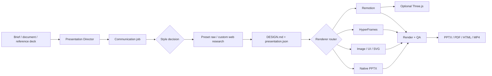

# Architecture

Presentation Director is a lightweight orchestration layer. It owns presentation decisions, shared contracts, routing, and acceptance criteria; specialist capabilities own generation.

[Back to README](../README.md) · [Installation](INSTALLATION.md) · [Development](DEVELOPMENT.md)

## System overview

The workflow is source-first. The final PPTX is a delivery artifact, not the only source of truth.

## Operating principles

1. **Narrative before style.** Define the audience, desired action, central takeaway, and slide roles before evaluating visual directions.
2. **Optional style checkpoint.** Respect specified, automatic, and recommendation modes instead of forcing one interaction model.
3. **References before design.** Load selected preset raw sources or research a custom direction before locking the visual identity.
4. **Design before assets.** Lock the visual identity before images, UI, diagrams, or motion are produced.
5. **Purpose before technology.** Choose a renderer because it communicates the slide correctly, not because the tool is available.
6. **One contract across providers.** Every provider reads the same design and presentation source files.
7. **Honest editability.** Native, mixed, flattened, and replaceable-media outputs are declared at slide level.
8. **Motion with a budget.** Animation is used for sequence, state change, product demonstration, or a meaningful reveal.
9. **Validation before delivery.** Structural checks and rendered-slide review are required for final output.

## Source-of-truth contracts

### `DESIGN.md`

`DESIGN.md` locks the shared visual identity before asset production. It should define:

- Presentation intent and audience.
- Primary design direction and permitted secondary references.
- Palette and contrast rules.
- Typography and type scale.
- Grid, margins, spacing, and density.
- Image and illustration direction.
- Diagram grammar.
- Motion language and motion budget.
- Brand, copyright, and asset restrictions.

All visual providers must read this file. Provider defaults must not override it.

### `presentation.json`

`presentation.json` tracks:

- Style-decision mode, candidates, selection rationale, and reference depth.
- Preset raw loading or custom web-research status and source records.
- Deck narrative and slide order.
- Slide roles and content.
- Renderer selection.
- Asset inputs and outputs.
- Motion and poster requirements.
- Editability classification.
- Source provenance.
- Capability profile and fallback approvals.
- Review and delivery status.

See the complete contract in [`manifest.md`](../skills/presentation-director/references/manifest.md).

## Renderer routing

| Slide task | Default route | Editability |
|---|---|---|
| Titles, body text, charts, and tables | Native PowerPoint | `native` |
| Simple architecture and process diagrams | Native PowerPoint shapes | `native` |
| Complex architecture, topology, and roadmaps | SVG / Graphviz | `mixed` |
| Hero, concept, and emotional visuals | Image generation | `flattened` or `mixed` |
| Product interfaces | HTML / React + browser capture | `mixed` |
| 3–15 second motion pieces | HyperFrames | `replaceable-media` |
| 15–90 second demos | Remotion | `replaceable-media` |
| Product turntables, exploded views, spatial layers | Three.js + `@remotion/three` | `replaceable-media` |

Detailed routing rules live in [`routing.md`](../skills/presentation-director/references/routing.md).

## Editability model

| Classification | Meaning |
|---|---|
| `native` | Text, shapes, charts, and other objects can be edited directly in PowerPoint. |
| `mixed` | The slide combines native objects with replaceable SVG, image, or captured UI assets. |
| `flattened` | The visual is rendered as a single image and cannot be edited as native slide objects. |
| `replaceable-media` | The animation or video can be replaced, but its internal elements are not editable in PowerPoint. |

A deck containing flattened or replaceable-media slides must not be described as fully editable.

## Motion routing

### Native presentation motion

Use for simple, maintainable builds and transitions when the target presentation engine supports them reliably.

### HyperFrames

Use for short, focused motion pieces such as:

- Progressive architecture builds.
- Title and section reveals.
- UI interaction highlights.
- Node, edge, and data-flow sequences.
- Short looping backgrounds or overlays.

The final static layout should be correct before animation is added.

### Remotion

Use for longer or multi-scene sequences such as:

- Product demos.
- Narrated explainers.
- Subtitle-driven sequences.
- Data-driven or parameterized video.
- Compositions that include deterministic Three.js scenes.

Every embedded video requires a static poster for preview, accessibility, and fallback playback.

## Three.js integration

Three.js is an optional component inside the `remotion_video` route, not a standalone deck renderer.

Good uses include:

- Product turntables.
- Exploded assemblies.
- Spatial hierarchy.
- Deliberate camera movement.
- Visualizations where depth carries meaning.

Avoid it for conventional architecture diagrams, charts, roadmaps, dense labels, or decorative “technology” effects.

Implementation constraints:

- Install Three.js, React Three Fiber, and `@remotion/three` only in projects that require 3D.
- Drive scenes, cameras, materials, and shader parameters from the deterministic Remotion frame timeline.
- Export MP4 or WebM plus a static poster.
- Record the source and license for models, textures, and environment maps.
- HyperFrames may composite a completed 3D video, but it must not manage an independent WebGL animation loop.

See [`renderers/threejs.md`](../skills/presentation-director/references/renderers/threejs.md) for the full contract.

## Review gates

Final output should pass:

- Capability preflight.
- Manifest and routing validation.
- Text overflow and safe-area checks.
- Cross-slide typography, color, and spacing review.
- Diagram-label and connector review.
- Image, source, and rights review.
- Motion-budget and poster checks.
- Rendered-slide visual QA.

Acceptance criteria are defined in [`review.md`](../skills/presentation-director/references/review.md).
